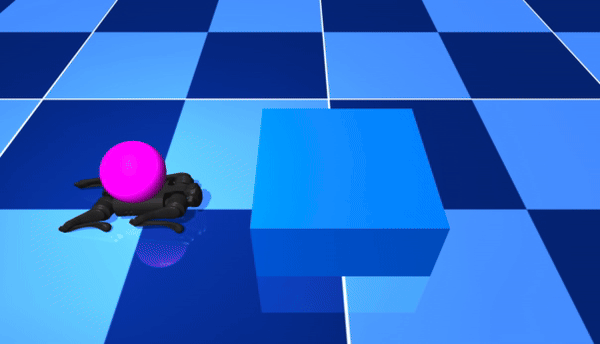
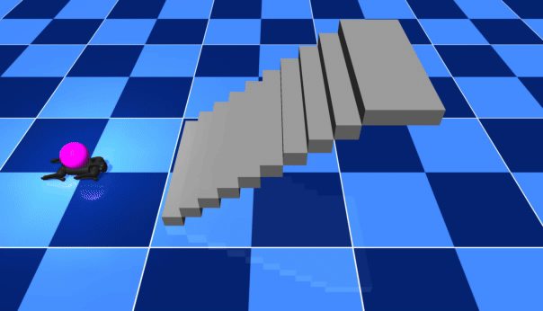
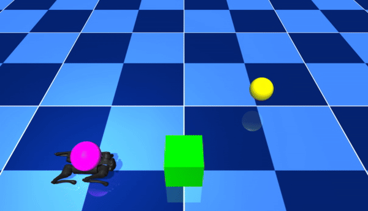

# Whole-Body MPPI

A Python implementation of a **Model Predictive Path Integral (MPPI)** controller for whole-body motion tasks of a quadruped robot in **[simulation](#simulation)** and **[hardware](#hardware)**. This project includes tasks such as general locomotion and box-pushing, with interactive Jupyter Notebooks to explore different functionalities.

### MPPI explained:

<center>


</center>

---
## **Release Note**  
* 🤖🐕 [2024/11/21] This is the **first release** of the Whole Body MPPI project. Key highlights of this release include:
    - Provides complete **MPPI controller implementations** for whole-body motion in simulation environments.
    - Focused entirely on **simulation tasks** for quadruped robots, showcasing general locomotion, stair climbing, and box pushing.
    - Includes interactive **Jupyter Notebooks** for experimenting with different MPPI tasks and configurations.
* 🛠️📡📦 [2025/05/17] The **hardware implementation code** for deploying tasks on Unitree Go1. Key highlights of this release include:
    - A dedicated **Hardware interface**  for real-time control of the Unitree Go1.
    - An integrated **Extended Kalman Filter (EKF)** for state estimation.
    - Support for motion capture integration via **Optitrack MoCap**.

* 🔔 Future updates:
    - Tools for generating **gait reference trajectories** to support new locomotion behaviors.
---

## Contents
- [Installation](#installation)
- [Tasks](#tasks)
- [Simulation](#simulation)
- [Notebooks](#notebooks)
- [Hardware](#hardware)
- [Definitions](#definitions)
- [License](#license)

---

## Installation

### MuJoCo Simulation ONLY
#### Prerequisites
- Python 3.9 or higher
- [Conda](https://docs.conda.io/en/latest/) (recommended for managing environments)

#### Steps
1. **Create a Conda Environment**  
   Create and activate a dedicated environment for this project:
   ```bash
   conda create --name whole-body-mppi python=3.9 -y
   conda activate whole-body-mppi
   ```
2. **Install the Package**
    Install the required Python packages:
    ```bash
    cd legged_mppi/
    pip install -e .
    ```
### Hardware Interface Installation
Our hardware interface is based on legged_control project from [ShuoYangRobotics](hhttps://github.com/ShuoYangRobotics/legged_control).
#### Prerequisites
- Docker
- VSCode (recommended) If you are using x86 64, directly use the devcontainer extension of VSCode to open the project. It will automatically load a docker image from dockerhub and give you all the environment.

#### Steps
1. **Open project in container using VSCode**

 After the docker is built and the container is running, you can either open a terminal in VSCode or access the container with this command: 
   ```
   docker exec -it CONTAINER_ID /bin/zsh
   ```
To get the `CONTAINER_ID`, use the following command and look for `legged_mppi_ctrl_container_go1` in the output:
```
docker ps
```

---
## Simulation
### Locomotion tasks

<center>

| **Walk Straight Task**                            | **Walk Octagon Task**                    |
|:----------------------------------------:|:----------------------------------------:|
|                |        |

| **Big Box Task**                          | **Stairs Task**                         |
|:----------------------------------------:|:----------------------------------------:|
|              |             |

</center>

### Locomanipulation task

<center>

| **Push a box**                            | 
|:----------------------------------------:|
|                |

</center>

## Notebooks
You can interact with the MPPI tasks using the provided Jupyter Notebooks:
1. Legged Locomotion
Notebook for general MPPI tasks:
```
legged_mppi/notebooks/MPPI_tasks.ipynb
```
2. Legged Locomanipulation
Notebook for box-pushing tasks:
```
legged_mppi/notebooks/MPPI_tasks_push.ipynb
```
---
## Scripts
To run a simulation, use the provided Python script:
```bash
   cd legged_mppi/scripts
   python simulate_mppi.py --task <task_name_sim>
```

If you are using the docker container, you can simply use:
```bash
   rosrun legged_mppi simulate_mppi.py --task <task_name_sim>
```

### Available Tasks (Mujoco Simulation)
The following tasks can be simulated:

- `walk_straight`
- `walk_octagon`
- `big_box`
- `stairs`

### Example Usage
Run a simulation for the `stairs` task:

```bash
python simulate_mppi.py --task stairs
```

If you are using the docker container:
```bash
rosrun legged_mppi simulate_mppi.py --task stairs
``` 
---
## Hardware
### Locomotion tasks

<center>

| **Walk Octagon Task**                            | **Climb Box Task**                    |
|:----------------------------------------:|:----------------------------------------:|
|                |        |

</center>

### Locomanipulation task

<center>

| **Push a box**                            | 
|:----------------------------------------:|
|                |

</center>
1. Run gazebo (for simulation or check if everything is working correctly):

```
roslaunch legged_controllers bringup_empty_world.launch 
```
Or run on the robot hardware:

```
roslaunch legged_controllers bringup_hw.launch 
```
2. Run the whole-bodyy MPPI controller:

For locomotion:
```
rosrun legged_mppi run_mppi_locomotion.py --task <task_name_hw> --pose_source <pose_source_name>
```

For locomanipulation:
```
rosrun legged_mppi run_mppi_locomomanipulation.py
```

### Available Tasks (Hardware)
The following tasks can run on hardware:

- `stand_hw`
- `walk_straight_hw`
- `walk_octagon_hw`
- `climb_box_hw`

### Available Pose Sources
The following sources can run on hardware:

- `ekf`
- `gazebo` (Only when running gazebo simulation)
- `mocap` (Only when running Optitrack node)

### Example Usage
Run robot for the `stand_hw` task using the extended Kalman filter:

```bash
rosrun legged_mppi run_mppi_locomotion.py --task stand_hw --pose_source ekf
```

### Note
You can check if the controller is running at 100 Hz with this command:

```bash
rostopic hz /joint_controller_FL_calf/cmd 
```

## Definitions
Tasks are defined in the `legged_mppi/whole_body_mppi/utils/tasks.py` file. This file contains the descrition of every task as a dictionary containing the following variables:

| **Parameter**       | **Description**                                                                                          |
|----------------------|----------------------------------------------------------------------------------------------------------|
| `goal_pos`          | List of 3D goal positions (x, y, z) the robot should reach.                                               |
| `default_orientation` | Default orientation in quaternion form `[w, x, y, z]`.                                                  |
| `cmd_vel`           | List of commanded velocity `[linear x, linear y]` in body frame at each goal.                                                     |
| `goal_thresh`       | List of threshold distances to consider the goal reached.                                                        |
| `desired_gait`      | List of gait patterns (e.g., `walk`, `trot`, `in_place`) for each stage.                                 |
| `waiting_times`     | List of timesteps to wait at each goal position. (100 timesteps are 1 second with the current setup)                                                                      |
| `model_path`        | Path to the robot's MuJoCo model XML file.                                                               |
| `config_path`       | Path to the YAML configuration file defining MPPI parameters.                                            |
| `sim_path`          | Path to the simulation scene file for the task.                                                          |

### Hyperparameter Configuration

MPPI hyperparameters are defined in YAML configuration files located in `legged_mppi/control/controllers/configs`.
These configuration files include:

#### **Simulation Parameters**
- **Time step (`dt`)**: Defines the simulation's time step size.
- **Horizon length (`horizon`)**: Specifies how many future steps are considered in planning.
- **Number of samples (`n_samples`)**: The number of trajectories sampled during planning.
- **Noise parameters (`noise_sigma`)**: The standard deviation of noise added to sampled trajectories.

#### **Cost Weights**
- **State cost matrix (`Q`, `Q_robot`, `Q_box`)**: Penalizes deviations from the desired state.
- **Control cost matrix (`R`)**: Penalizes large or sudden control inputs.

#### **Temperature (`lambda`)**
- Governs the balance between exploration and exploitation in MPPI.

To adjust these settings, simply edit the relevant YAML file (e.g., `config.yaml`) and rerun your task.

### Robot Models and Task Scenes
The robot models and task-specific scenes are located in `legged_mppi/whole_body_mppi/models`.

This directory contains:

* Robot Models: MuJoCo XML files defining the robot's body, joints, actuators, and sensors.
* Task Environments: XML files describing the physical environment for tasks, including obstacles and dynamic objects.

### Directory Structure
Here’s an overview of the project structure for reference:

```graphql
RTWholeBodyMPPI/
├── legged_mppi
│   ├── CMakeLists.txt
│   ├── notebooks
│   │   ├── MPPI_tasks.ipynb
│   │   └── MPPI_tasks_push.ipynb
│   ├── package.xml
│   ├── pyproject.toml
│   ├── requirements.txt
│   ├── scripts
│   │   ├── run_mppi_locomanipulation.py
│   │   ├── run_mppi_locomotion.py
│   │   └── simulate_mppi.py
│   ├── setup.py
│   └── whole_body_mppi
│       ├── analysis
│       │   └── ...
│       ├── control
│       │   ├── controllers
│       │   │   ├── base_controller.py
│       │   │   ├── configs
│       │   │   │   ├── mppi_gait_config_big_box.yml
│       │   │   │   ├── mppi_gait_config_climb_box_hw.yml
│       │   │   │   ├── mppi_gait_config_push_box_hw.yml
│       │   │   │   ├── mppi_gait_config_push_box.yml
│       │   │   │   ├── mppi_gait_config_stairs.yml
│       │   │   │   ├── mppi_gait_config_walk_hw.yml
│       │   │   │   └── mppi_gait_config_walk.yml
│       │   │   ├── mppi_locomanipulation.py
│       │   │   └── mppi_locomotion.py
│       │   ├── gait_scheduler
│       │   │   ├── gaits
│       │   │   │   ├── FAST
│       │   │   │   │   └── *.tsv
│       │   │   │   ├── MED
│       │   │   │   │   └── *.tsv
│       │   │   │   └── SLOW
│       │   │   │       └── *.tsv
│       │   │   └── scheduler.py
│       │   └── __init__.py
│       ├── __init__.py
│       ├── interface
│       │   ├── configs
│       │   │   └── simulator.yml
│       │   ├── __init__.py
│       │   └── simulator.py
│       ├── models
│       │   ├── common.xml
│       │   └── go1
│       │       ├── assets
│       │       ├── go1_mppi_all_contacts.xml
│       │       ├── go1_mppi_cf.xml
│       │       ├── go1_mppi_pyr.xml
│       │       ├── go1_mppi.xml
│       │       ├── go1_scene_mppi_pyr_big_box.xml
│       │       ├── go1_scene_mppi_pyr_climb_box_hw.xml
│       │       ├── go1_scene_mppi_pyr_med_box_mujoco.xml
│       │       ├── go1_scene_mppi_pyr_push_box_14in.xml
│       │       ├── go1_scene_mppi_pyr_push_box_prop.xml
│       │       ├── go1_scene_mppi_pyr_push_box.xml
│       │       ├── go1_scene_mppi_pyr.xml
│       │       ├── go1_scene_mppi_stairs.xml
│       │       ├── go1_scene_mppi.xml
│       │       ├── LICENSE
│       │       ├── README.md
│       │       └── urdf
│       └── utils
│           ├── __init__.py
│           ├── tasks.py
│           └── transforms.py
├── animations
│   ├── ...
├── bags
│   ...
├── .devcontainer
│   ├── configure_xauth.bash
│   ├── devcontainer.json
│   └── Dockerfile_go1
├── Dockerfile_go1
├── legged_common
│   ├── ...
├── legged_control
│   ├── ..
├── legged_controllers
│   ├── ...
│   ├── launch
│   │   ├── bringup_empty_world.launch
│   │   ├── bringup_hw.launch
│   │   ├── ...
│   └── ...
├── legged_estimation
│   └── ...
├── legged_examples
│   └── ...
├── legged_gazebo
│   ├── ...
│   └── worlds
│       ├── box_world_hw.world
│       ├── box_world.world
│       └── empty_world.world
├── legged_hw
│   └── ...
├── legged_interface
│   └── ...
├── legged_wbc
│   └── ...
├── LICENSE
├── mocap_optitrack
│   └── ...
├── qpoases_catkin
│   └── ...
├── qpos_visualizer
│   ├── CMakeLists.txt
│   ├── package.xml
│   └── scripts
│       ├── qpos_visualizer_mujoco_37.py
│       └── qpos_visualizer_mujoco.py
├── README.md
├── setup_ros_ws.sh
└── unitree_legged_msgs
    ├── CMakeLists.txt
    ├── msg
    │   ├── Cartesian.msg
    │   ├── GaitState.msg
    │   ├── GoalState.msg
    │   ├── HighCmd.msg
    │   ├── HighState.msg
    │   ├── IMU.msg
    │   ├── LED.msg
    │   ├── LowCmd.msg
    │   ├── LowState.msg
    │   ├── LowStateStamped.msg
    │   ├── MotorCmd.msg
    │   ├── MotorState.msg
    │   └── TaskConfig.msg
    └── package.xml              

```
---

## License
This project is licensed under the [MIT License](./LICENSE). Feel free to use, modify, and distribute this code.

## Citation
If you find this code useful, please consider citing our paper:
```
@inproceedings{alvarez2025realtime,
        title={Real-Time Whole-Body Control of Legged Robots with Model-Predictive Path Integral Control},
        author={Alvarez-Padilla, Juan and Zhang, John Z. and Kwok, Sofia and Dolan, John M. and Manchester, Zachary},
        url = {https://arxiv.org/abs/2409.10469},
        booktitle = {IEEE International Conference on Robotics and Automation},
        year={2025},
      }
```
